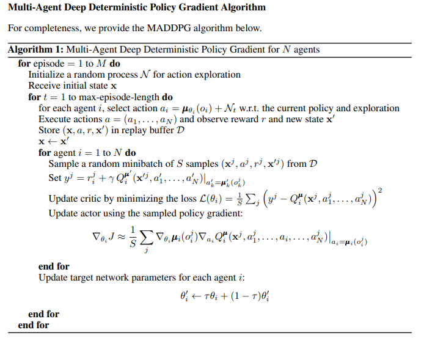
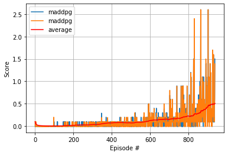

# Deep Reinforcement Learning Agent for Tennis App 

## Implementation Details 

Implemented and trained MADDPG algorithm for solving Tennis environment. Here's the gif of the trained agent


### MADDPG 

The implementation of maddpg is in ```agents/maddpg.py``` and the trained model for both the agents can be found at
* ```models/checkpoint_actor_0_final.pth```
* ```models/checkpoint_actor_1_final.pth```
* ```models/checkpoint_critic_0_final.pth```
* ```models/checkpoint_critic_1_final.pth```

It is inspired by the original paper and here's the snapshot of the algorithm from the paper:



#### Actor Architecture
```
Actor(
  (fc1): Linear(in_features=24, out_features=512, bias=True)
  (fc2): Linear(in_features=512, out_features=256, bias=True)
  (fc3): Linear(in_features=256, out_features=2, bias=True)
  (bn1): BatchNorm1d(512, eps=1e-05, momentum=0.1, affine=True, track_running_stats=True)
)
```

#### Critic Architecture
```
Critic(
  (fcs1): Linear(in_features=24, out_features=512, bias=True)
  (bn1): BatchNorm1d(512, eps=1e-05, momentum=0.1, affine=True, track_running_stats=True)
  (fc2): Linear(in_features=514, out_features=256, bias=True)
  (fc3): Linear(in_features=256, out_features=1, bias=True)
)
```

I used pretty simple 2-layer neural network for both Actor & Critic. For Actor the network has 24 units in the input layer, 512 in the first hidden layer, 256 units in the second hidden layer, and 2 units in the output layer. And for Critic 24 units in the input layer, 514 in the first hidden layer, 256 units in the second hidden layer, and 1 unit in the output layer.

I also used Batch Normalization which helped with faster training and increases the stability during the training process.

The networks are defined in ```networks\model.py```

These are other the key pieces of the algorithm:

### Shared Experience Replay Buffer

Experience replay allows the RL agent to learn from past experiences. Each experience is stored in a replay buffer as the agent interacts with the environment. The replay buffer contains experience tuples with the state, action, reward, and next state ```(s, a, r, s')```. The agent randomly samples from this buffer as part of the training. Random samplaing helps with the problem of correlated data. This prevents action values from oscillating, since a naive Q-learning algorithm could otherwise become biased by correlations between sequential experience tuples.

Also, experience replay improves learning through repetition. By doing multiple passes over the data, our agent has multiple opportunities to learn from a single experience tuple. This is particularly useful for state-action pairs that occur infrequently within the environment.

The implementation of the replay buffer can be found here in the ```buffers/ReplayBuffer.py``` file of the source code.

In order to solve **Multi-Agent** problem I used shared experience replay buffer. The experience tuples from both the agents were added to the buffer and for the learning part agents would then sample from the shared buffer. Here's the step function in ```agents/maddpg.py``` highlighting the piece where experiences got added into a shared buffer. 

```
    def step(self, states, actions, rewards, next_states, dones):
        for s,a,r,ns,d in zip(states, actions, rewards, next_states, dones):
            self.memory.add(s,a,r,ns,d)
            
        self.t_step = (self.t_step + 1) % self.update_every
        if self.t_step == 0 and len(self.memory) > self.batch_size:
            for _ in range(self.num_updates):
                for agent in self.maddpg_agents:
                    experiences = self.memory.sample()
                    agent.learn(experiences, self.gamma)
```

### Target Network 

Iterative update that adjusts the action-values towards target values that are only periodically updated, thereby reducing correlations with the target.

The target values are updated based on this equation. 
```
 θ_target = τ*θ_local + (1 - τ)*θ_target
```

You can find logic implemented in ```soft_update()``` method in ```ddpg_agent.py``` of the source code. 

### Noise 

I used OU noise which was recommended in the original DDPG paper. In ```agents/maddpg.py``` the noise is added to the action generated by the actor in ```act``` function. The OU noise is correlated to previous noise and therefore tends to stay in the same direction for longer durations.  

I didn't use epsilon greedy as it's more suited for discrete action spaces. For this problem it's a continuous action space. 

```
    def act(self, state, add_noise=True):
        """Returns actions for given state as per current policy."""
        state = torch.from_numpy(state).float().to(device)
        self.actor_local.eval()
        with torch.no_grad():
            action = self.actor_local(state).cpu().data.numpy()
        self.actor_local.train()
        
        if add_noise:
            action += self.noise.sample()
        return np.clip(action, -1, 1)
```       

## Hyperparameters 

The agent uses these parameters
```
BUFFER_SIZE = int(1e6)  # replay buffer size
BATCH_SIZE = 256        # minibatch size
GAMMA = 0.99            # discount factor
UPDATE_EVERY = 4        # Train agents every 4 steps 
NUM_UPDATES = 1         # How many times agents should be trained
TAU = 0.02              # for soft update of target parameters
LR_ACTOR = 1e-4         # learning rate of the actor 
LR_CRITIC = 3e-4        # learning rate of the critic
WEIGHT_DECAY = 0        # L2 weight decay
```

I used a larger learning rate of ```3e-4``` for Critic compared to Actor's ```1e-4```, as this allows Crtic to learn faster than the Actor, since Actor relies on crtic for learning. I used a discount factor of ```0.99``` to force the agents to be aware of long term consequences.

The training part uses these paramters
```
Number of training episodes = 3000
Max number of steps in an episode = 1000
```
## Results

I was able to achieve the score of 0.5 in 938 episodes



### Observations 
* Batch Normalization and slowing the learning rate helped with faster training 

## Ideas for future work 
- Tuning of hyperparameters for the network 
- Use Prioritized Experience Replay ([Link](https://arxiv.org/pdf/1511.05952.pdf))
- Implement Multi Agent version of PPO
